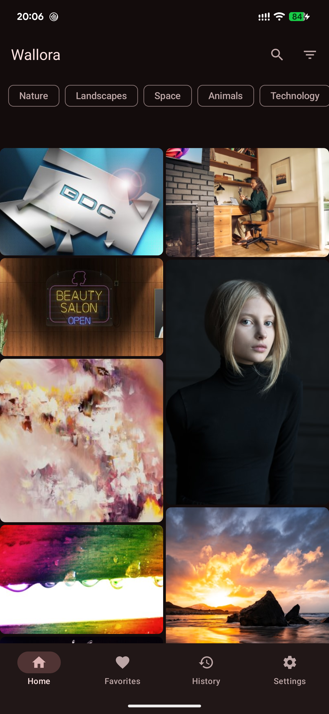
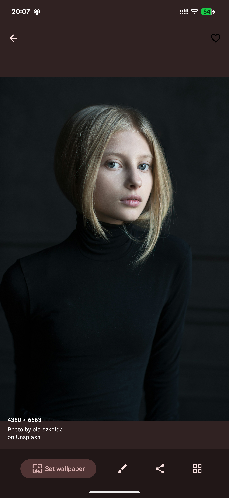
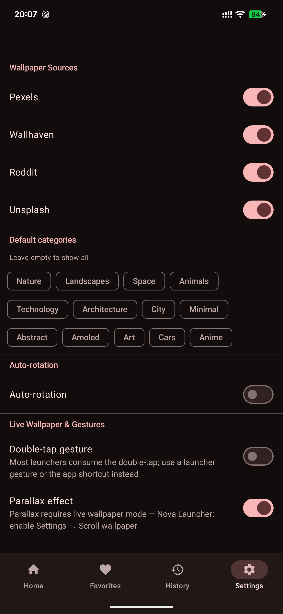
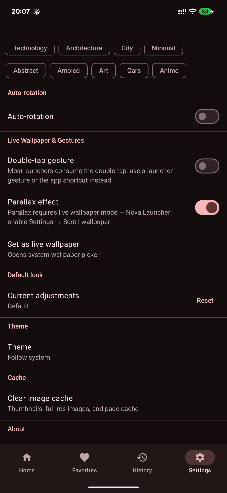

# Wallora

**A minimal, Material You wallpaper app for Android — 100% free, no ads, no subscriptions, ever.**

Browse, search, and auto-rotate stunning wallpapers from Pexels, Wallhaven, Unsplash, and Reddit. Wallora is the only free app that ties all of this together: a live wallpaper engine with Material You colour extraction, gesture-based wallpaper swapping from any launcher, a Quick Settings tile, and a home-screen widget — features that are either missing from other apps or locked behind a paywall.

[](https://github.com/thissayantan/wallora/actions/workflows/release.yml)
[](https://developer.android.com/about/versions/12/android-12)
[](LICENSE)
[](https://kotlinlang.org)

<p align="center">
  <a href="https://github.com/thissayantan/wallora/releases/latest">
    
  </a>
  &nbsp;
  <a href="https://apt.izzysoft.de/fdroid/index/apk/com.wallora.app">
    
  </a>
</p>

---

## Why Wallora?

| | What makes it different |
|---|---|
| **Free** | No ads, no subscriptions, no in-app purchases — and open source. |
| **Material You** | Sets wallpaper colours back into Android so your entire UI — system bars, widgets, apps — adapts instantly to every wallpaper change. |
| **Auto-rotation without opening the app** | Scheduled rotation via WorkManager, time-of-day alarms, and on-unlock triggers all run silently in the background. |
| **Change wallpaper from anywhere** | Launcher gesture, Quick Settings tile, home-screen widget, Tasker intent — no other free app exposes all four. |
| **Prefetch cache** | The next wallpaper is downloaded in the background immediately after each apply, so swapping feels instant. |

---

## Features

| | Feature |
|---|---|
| 🖼️ | **Multi-source browsing** — staggered grid from Pexels, Wallhaven, Unsplash, and Reddit |
| 🔍 | **Search** — real-time fan-out search across all enabled sources simultaneously |
| 🏷️ | **Category filters** — Nature, Space, Animals, Abstract, AMOLED, Anime, and more |
| ❤️ | **Favorites & History** — persist your saves and track what you've set |
| 👁️ | **Full-res preview** — hardware-safe decode with per-image error states |
| ✏️ | **Editor** — blur, brightness, contrast, saturation, pan; apply or save as default |
| 🔄 | **Auto-rotation** — interval (WorkManager) + specific times (AlarmManager) + on-unlock |
| 🌊 | **Live wallpaper** — parallax scrolling, crossfade transitions, Material You colours |
| 🪟 | **Home-screen widget** — current wallpaper thumbnail + one-tap "Next" button |
| 🔲 | **Quick Settings tile** — change wallpaper from the notification shade without unlocking |
| 🎨 | **Material You** — dynamic colour extracted from the live wallpaper bitmap |
| 🌙 | **Theme** — System / Light / Dark |
| ⚡ | **Prefetch cache** — next wallpaper downloaded in the background after each apply |

---

## Screenshots

<table>
  <tr>
    <td align="center"><br/><sub>Home grid</sub></td>
    <td align="center"><br/><sub>Full-res preview</sub></td>
    <td align="center"><br/><sub>Settings — sources</sub></td>
    <td align="center"><br/><sub>Settings — live wallpaper & gestures</sub></td>
  </tr>
</table>

---

## Automatic wallpaper changing & Material You

Wallora runs a background rotation engine that changes your wallpaper on a schedule you control — no taps required. Every time a new wallpaper is applied:

1. The live wallpaper engine decodes the bitmap and calls `notifyColorsChanged()`.
2. Android extracts dominant colours from the bitmap and seeds the Material You palette.
3. Your system UI (status bar, nav bar), widgets, and supporting apps re-theme themselves automatically.

You set the interval (15 min → 24 h), pick a playlist or use the curated category feed, and Wallora does the rest.

---

## Change wallpaper without opening the app

This is where Wallora stands out from every other free wallpaper app. You can trigger "next wallpaper" from four different places — pick whichever fits your workflow:

### 1. Launcher gesture (Nova Launcher, Lawnchair, etc.)

| Launcher | Steps |
|---|---|
| **Nova Launcher** | Nova Settings → Gestures & inputs → pick a gesture (e.g. double-tap) → App shortcuts → Wallora → **Next wallpaper** |
| **Lawnchair** | Home screen settings → Gestures → choose gesture → App shortcuts → Wallora → **Next wallpaper** |
| **Any launcher** | Long-press the Wallora icon → **Next wallpaper** (static shortcut, works everywhere) |

After tapping, you'll see a brief "Changing wallpaper…" toast and the wallpaper updates in seconds (usually instant if prefetch already ran).

### 2. Quick Settings tile (no unlock needed)

1. Pull down the notification shade and tap the pencil / edit icon.
2. Find **Next wallpaper** in the tile list and drag it to your active tiles.
3. Tap the tile at any time — even from the lock screen — to swap wallpapers instantly.

This is unique to Wallora among free apps. No other free wallpaper app ships a functional Quick Settings tile.

### 3. Home-screen widget

Add the **Wallora widget** to your home screen. It shows the current wallpaper as a thumbnail. Tapping the **Next** button changes the wallpaper without opening the app.

### 4. Tasker / automation apps

Send an explicit intent to trigger the next wallpaper from any automation app (Tasker, MacroDroid, Automate, etc.):

```
Action:   com.wallora.app.action.NEXT_WALLPAPER
Package:  com.wallora.app
Class:    com.wallora.app.ui.NextWallpaperActivity
```

In Tasker: **Task → App → Send Intent** with the values above.

---

## Getting Started

### Requirements

- Android **12** (API 31) or higher
- JDK 17
- Android SDK with `platforms;android-35` and `build-tools;35.0.0`

### Install from IzzyOnDroid (recommended for auto-updates)

1. Install [F-Droid](https://f-droid.org) on your Android device.
2. In F-Droid, go to **Settings → Repositories → +** and add:
   ```
   https://apt.izzysoft.de/fdroid/repo
   ```
3. Search for **Wallora** and install it — F-Droid will keep it up to date automatically.

> **Note:** The IzzyOnDroid listing goes live once the inclusion request is accepted. Until then, sideload the APK from [Releases](https://github.com/thissayantan/wallora/releases/latest).

### Quick build

```bash
export JAVA_HOME=$HOME/.local/jdk17      # or wherever your JDK 17 lives
export ANDROID_HOME=$HOME/Android/Sdk
./gradlew assembleDebug
```

Install on a connected device:

```bash
adb install app/build/outputs/apk/debug/app-debug.apk
```

### Running tests

```bash
./gradlew testDebugUnitTest
```

All unit tests are pure JVM / Robolectric — no device or emulator needed.

---

## API key setup

Wallora works **out of the box** with Wallhaven (SFW) and Reddit — no key required.

For higher-quality sources, copy `local.properties.example` to `local.properties` (already `.gitignore`d) and add your keys:

```properties
sdk.dir=/home/<you>/Android/Sdk

# Pexels — https://www.pexels.com/api/  (free)
PEXELS_API_KEY=your_key_here

# Unsplash — https://unsplash.com/developers  (free)
UNSPLASH_ACCESS_KEY=your_access_key_here

# Wallhaven — https://wallhaven.cc/settings/account  (optional; unlocks NSFW filter)
WALLHAVEN_API_KEY=your_key_here
```

Sources without a key are shown as **disabled** in Settings → Sources. They are still compiled in behind `isConfigured = false` and tested against committed JSON fixtures.

---

## Architecture

```
app/
  data/
    local/       Room: WallpaperEntity, FavoriteEntity, HistoryEntity, RecentSearchEntity
    remote/      Pexels · Wallhaven · Reddit · Unsplash  (Retrofit + kotlinx.serialization)
    paging/      MultiSourcePagingSource (round-robin fan-out + URL dedup)
    repository/  WallpaperRepository, SettingsRepository (DataStore Preferences)
    util/        SafeBitmapDecoder, ImageAdjustments
  domain/
    model/       Wallpaper, Category, SourceId, EditParams
    rotation/    RotationEngine (no-repeat window, playlist selection)
    usecase/     ApplyWallpaperUseCase, NextWallpaperUseCase (prefetch + candidate cache)
  ui/
    home/        HomeScreen + HomeViewModel (staggered grid, category chips)
    search/      SearchScreen + SearchViewModel (fan-out, recent searches)
    detail/      DetailScreen + DetailViewModel (full-res preview, actions)
    editor/      EditorScreen + EditorViewModel (adjustments, live preview)
    favorites/   FavoritesScreen + FavoritesViewModel
    history/     HistoryScreen + HistoryViewModel
    settings/    SettingsScreen + SettingsViewModel
    navigation/  WalloraNavGraph (typed sealed routes, bottom nav)
    theme/       WalloraTheme (dynamic colour, edge-to-edge)
  service/
    WalloraWallpaperService   Live wallpaper engine (parallax, crossfade)
    WalloraQsTileService      Quick Settings tile
    helpers/                  ParallaxMath, CrossfadeAnimator, CropCalculator
  widget/
    WalloraWidget             Glance app widget + NextWallpaperAction
  worker/
    RotationWorker            WorkManager periodic interval rotation
    AlarmScheduler            AlarmManager exact/inexact alarm scheduling
    BootReceiver              Re-registers alarms on BOOT_COMPLETED
```

**Key decisions:**
- Custom fan-out `PagingSource` (not `RemoteMediator`) for multi-source interleave
- Non-RenderScript blur: downscale → iterative box blur → upscale
- Parallax via over-wide bitmap (1.3×) + `onOffsetsChanged` translation
- `allowHardware(false)` in detail preview to sidestep GPU texture-size overflow on high-res images
- Baseline Profile deferred (requires device/managed emulator); see `DECISIONS.md`

---

## Contributing

Pull requests are welcome! Please:

1. Fork the repo and create a feature branch
2. Follow the existing Kotlin style (official Kotlin coding conventions)
3. Add or update unit tests for logic changes
4. Run `./gradlew testDebugUnitTest lintDebug` before opening a PR
5. Open a PR describing what changed and why

For bug reports, please include your device model, Android version, and steps to reproduce.

---

## License

```
MIT License

Copyright (c) 2026 Sayantan Das

Permission is hereby granted, free of charge, to any person obtaining a copy
of this software and associated documentation files (the "Software"), to deal
in the Software without restriction, including without limitation the rights
to use, copy, modify, merge, publish, distribute, sublicense, and/or sell
copies of the Software, and to permit persons to whom the Software is
furnished to do so, subject to the following conditions:

The above copyright notice and this permission notice shall be included in all
copies or substantial portions of the Software.

THE SOFTWARE IS PROVIDED "AS IS", WITHOUT WARRANTY OF ANY KIND, EXPRESS OR
IMPLIED, INCLUDING BUT NOT LIMITED TO THE WARRANTIES OF MERCHANTABILITY,
FITNESS FOR A PARTICULAR PURPOSE AND NONINFRINGEMENT. IN NO EVENT SHALL THE
AUTHORS OR COPYRIGHT HOLDERS BE LIABLE FOR ANY CLAIM, DAMAGES OR OTHER
LIABILITY, WHETHER IN AN ACTION OF CONTRACT, TORT OR OTHERWISE, ARISING FROM,
OUT OF OR IN CONNECTION WITH THE SOFTWARE OR THE USE OR OTHER DEALINGS IN THE
SOFTWARE.
```

Photo content is served from third-party APIs per each source's license. See Settings → About for per-source attribution.
